# Bambu Lab A1

This document repo as a personal knowledge base and future reference for settings, essential information, collected 3D models, upgrades, and projects related to the Bambu Lab A1 3D Printer.

  

## Technical Specifications
<a href="https://bambulab.com/en/a1/tech-specs" target="_blank">Technical Specifications A1</a>

| Parameter | Value |
|:---|:---|
| Number of Toolheads | 1 |
| Multi-Color Capability | 4 Colors (via included AMS lite) |
| Build Volume (W×D×H) | 256 mm × 256 mm × 256 mm |
| Printing Method | Wi-Fi (Bambu Studio, Handy App) / Micro SD Card |
| HMI (Interface) | 3.5-inch 320x240 IPS Touch Screen |
| Max Toolhead Speed | 500 mm/s |
| Max Toolhead Acceleration | 10,000 mm/s² |
| Max Hot End Temperature | 300 °C (All-Metal Hot End) |
| Max Heated Bed Temperature | 100 °C |
| Printing Platform | Flexible Steel Plate |
| Compatible Build Plates | Bambu Textured PEI Plate, Cool Plate, High Temperature Plate |
| Print Accuracy Features | Full-Auto Calibration (Z-Offset, Bed Leveling, Vibration) |
| Recommended Filament (Ideal) | PLA, PETG, TPU, PVA |
| Consumable Filament Diameter | 1.75 mm |
| Print File Format | G-Code |
| Machine Dimensions (W×D×H) | 465 mm × 410 mm × 430 mm |
| Machine Weight (Net) | 8.3 kg |
| Power Supply (Input/Max Power) | 100–240 VAC, 50/60 Hz / 350W (110V) or 1300W (220V) |
| Motion Controller | Dual-Core Cortex M4 |
| Connectivity | Wi-Fi, Bambu-Bus |
| Camera | Low Rate Camera (Up to 1080P) |

## :large_blue_circle: Upgrades and Accessories

### :small_blue_diamond: AMS Lite Numbers Highlight
Custom 3D-printed covers designed to highlight or change the color of the spool slot numbers on the AMS lite for improved visibility and organization.
* **Model Link:** [Enveloping AMS-lite Number Covers (MakerWorld)](https://makerworld.com/en/models/928502-enveloping-ams-lite-number-covers#profileId-892075)

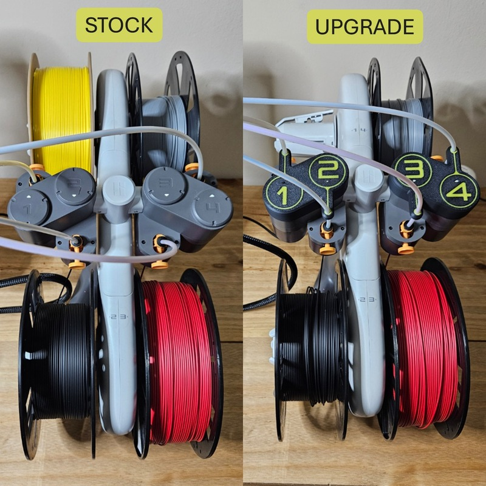

### :small_blue_diamond: Allen Key Handle
Custom 3D-printed handle designed to improve the ergonomics and grip of the Bambu Lab A Series Allen keys. The design is **print-in-place** for immediate use.
* **Model Link:** [Bambulab A Series Allen key (MakerWorld)](https://makerworld.com/en/models/1084171-bambulab-a-series-allen-key-print-in-place#profileId-1076617)

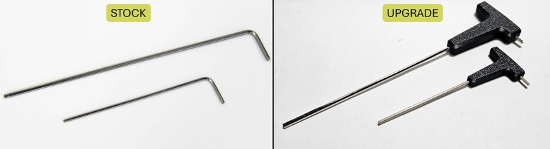

**NOTE**
> This model features a **print pause**. During the pause, the Allen key must be inserted into the slot so it can be enclosed by the rest of the print.
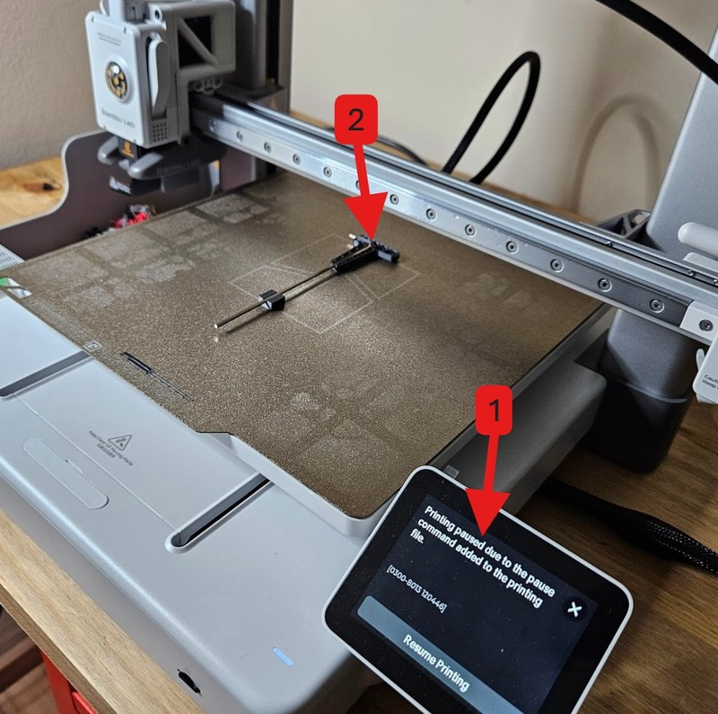

### :small_blue_diamond: Bambu Lab Toolbox
Modular and compact toolbox specifically designed for the Bambu Lab A1 printer. The design is **print-in-place**, featuring integrated hinged drawers for storing parts and tools.
* **Model Link:** [A1 Toolbox (MakerWorld)](https://makerworld.com/en/models/639173-a1-toolbox-print-in-place#profileId-860527)

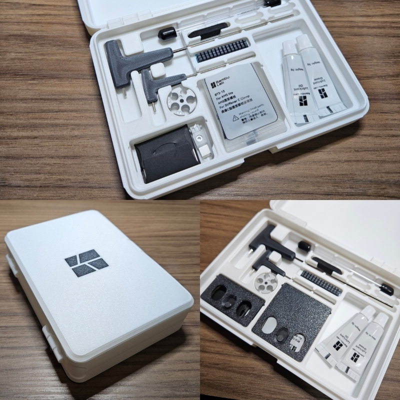

### :small_blue_diamond: A1 Waste Bucket
A waste bucket designed to be attached to the Bambu Lab A1 printer, featuring an additional slot for scraper storage. Helps keep the printing area clean and organized.
* **Model Link:** [A1 Poop Bucket (MakerWorld)](https://makerworld.com/en/models/879014-a1-poop-bucket-with-scraper-holder#profileId-832688)

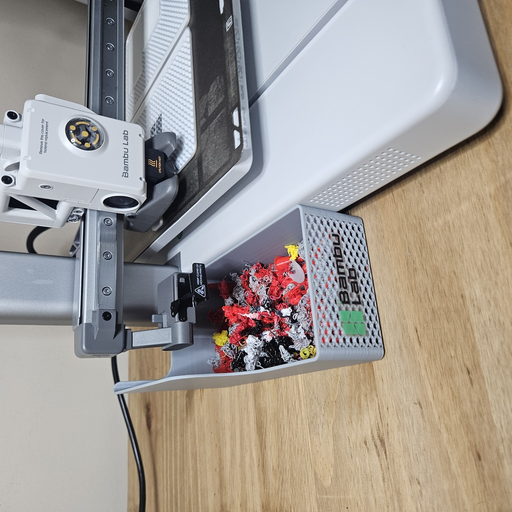

### :small_blue_diamond: Bambu Lab Bed Scraper
A redesigned, custom bed scraper available in two versions (flat or angled) to efficiently remove prints from the build plate while improving grip and handling.
* **Model Link:** [Bambu Lab Bed Scraper (MakerWorld)](https://makerworld.com/en/models/914848-new-bambu-lab-bed-scraper-two-versions#profileId-876358)

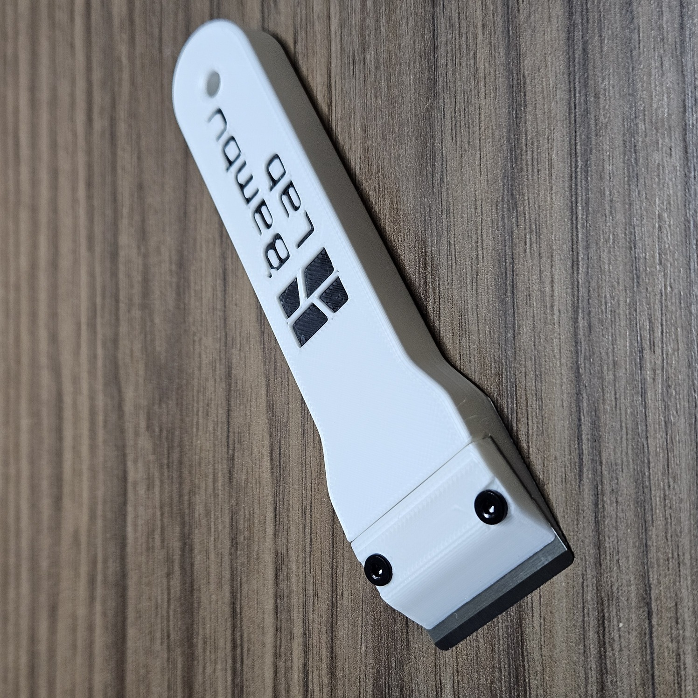

### :small_blue_diamond: Toolhead PTFE Tubes Identifier
Custom guide covers with numbering designed to clearly identify and organize the PTFE tubes and power cable connections on the A1 Series toolhead, improving visibility and maintenance.
* **Model Link:** [Numbered PTFE & Power Cable Guide for A1 Series (MakerWorld)](https://makerworld.com/en/models/1686183-numbered-ptfe-power-cable-guide-for-a1-series#profileId-1786772)

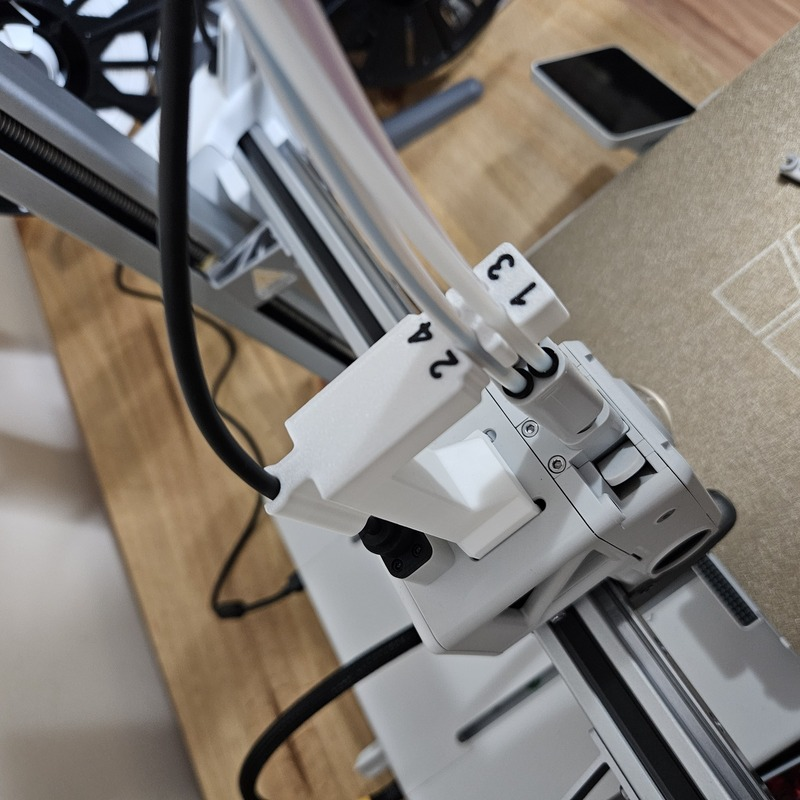

### :small_blue_diamond: PTFE Tube Removal Tool
Tool specifically designed to simplify the process of removing PTFE tubes from the AMS on the A1 and A1 mini printers, minimizing hassle and potential damage.
* **Model Link:** [PTFE Tube Removal Tool for AMS A1 and A1 mini (MakerWorld)](https://makerworld.com/en/models/684171-ptfe-tube-removal-tool-for-ams-a1-and-a1-mini#profileId-612835)

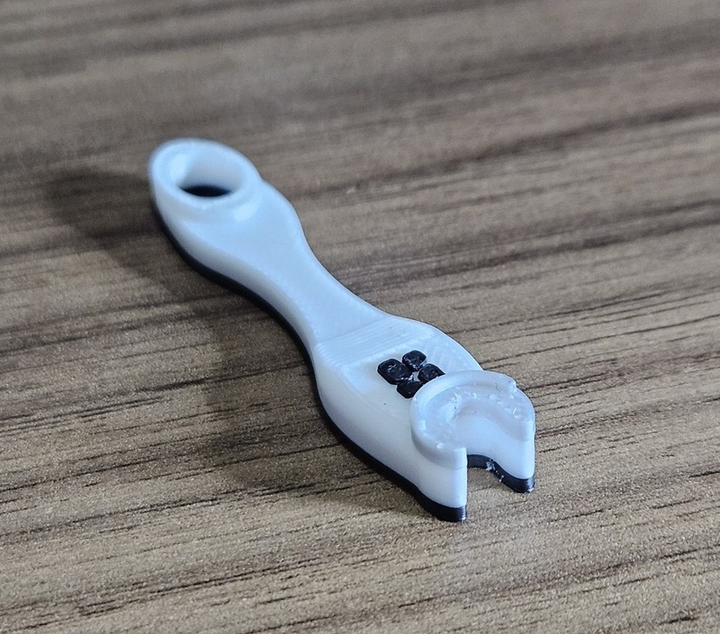

### :small_blue_diamond: A1 Side Cable Guide
A custom guide designed to manage and secure the cables on the side of the A1 printer, helping to prevent snagging and wear, and keeping the printer's appearance clean.
* **Model Link:** [A1 Cable Guide (MakerWorld)](https://makerworld.com/en/models/533092-a1-cable-guide#profileId-449944)

---

## :large_blue_circle: Projects & Organizational Systems

### :small_blue_diamond: Gridfinity
A modular storage system based on a standardized 42×42 mm grid, ensuring compatibility between all modules. It is **free and open-source**. Optimized for dense organization of small items using stackable containers and inserts.

* **Official Website:** [https://gridfinity.xyz/](https://gridfinity.xyz/)
* **Original Creator:** Zack Freedman
* **Introduction Video:** [Gridfinity: Your Ultimate Modular Workshop is FREE!](https://www.youtube.com/watch?v=ra_9zU-mnl8&t=275s)

**My Build:**

| 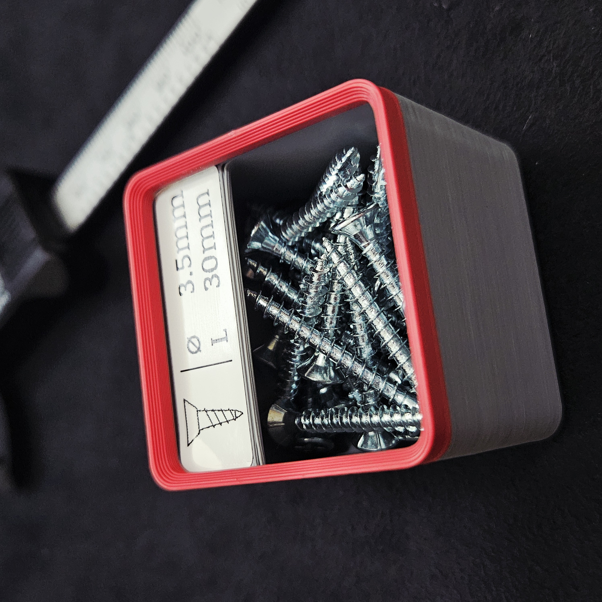 | 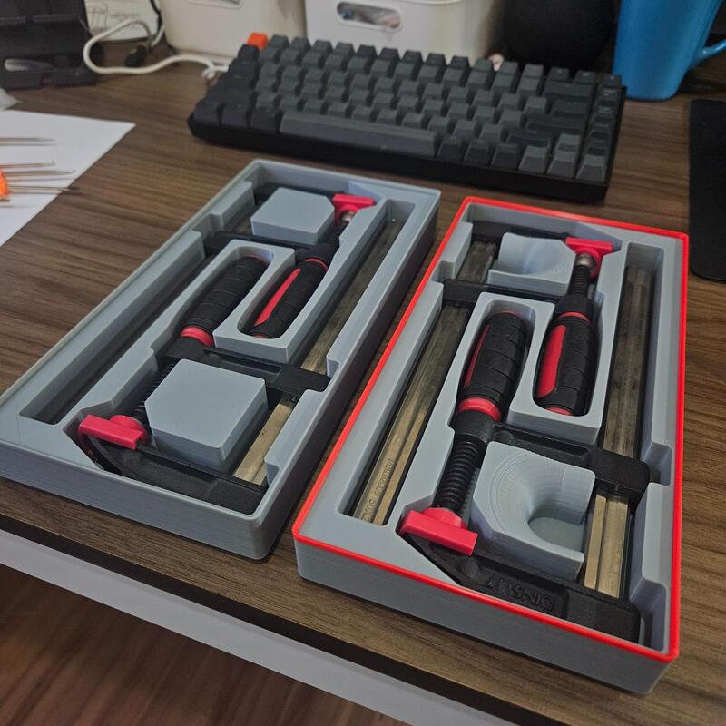 |  |
|:---|:---|:---|
|  | 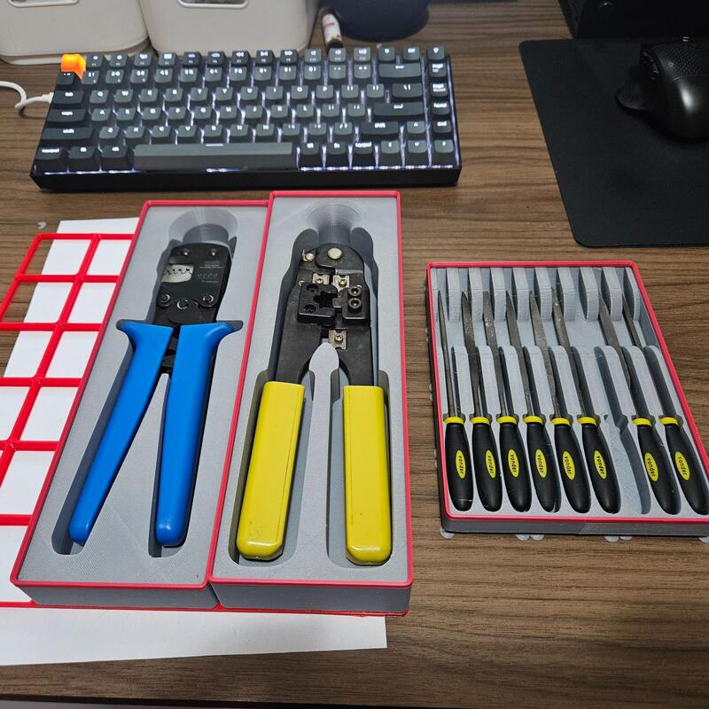 | 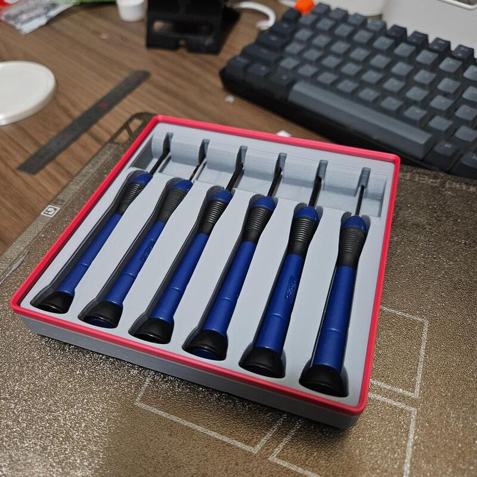 |
| 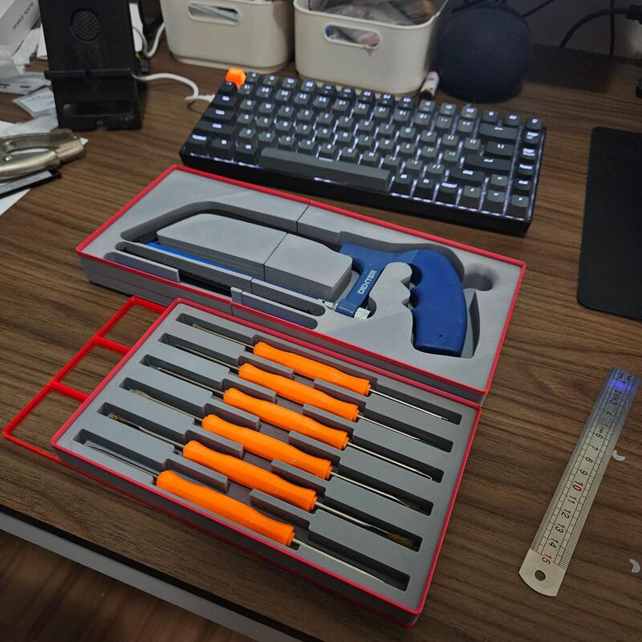 | 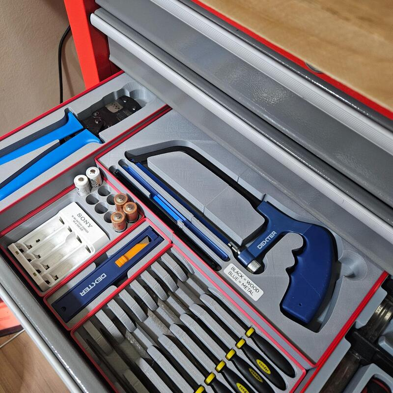 | 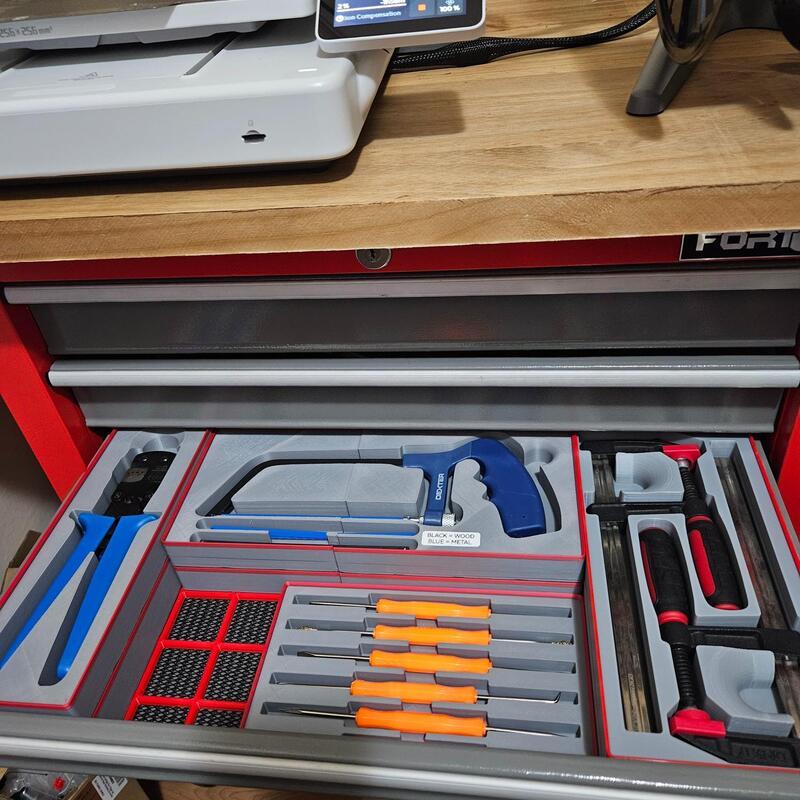 |

**Slicer Settings**

This profile is optimized for **Extra Draft** speed, prioritizing quick prints over fine detail.

| Parameter | Value |
| :--- | :--- |
| **Nozzle Diameter** | 0.6 mm |
| **Slicer Profile** | Extra Draft |

**Quality Settings**

| Parameter | Value | Description |
| :--- | :--- | :--- |
| **Layer Height** | 0.4 mm | Maximized layer height for fast printing (Extra Draft quality). |

**Strength and Infill Settings**

| Parameter | Value | Description |
| :--- | :--- | :--- |
| **Top Shell Layers** | 2 | Number of solid layers covering the top surface. |
| **Top Paint Penetration Layers** | 2 | Layers used for top surface smoothing/ironing or specific surface texture (if supported by slicer). |
| **Bottom Shell Layers** | 2 | Number of solid layers covering the bottom surface. |
| **Bottom Paint Penetration Layers** | 2 | Layers used for bottom surface smoothing/texture (if supported by slicer). |
| **Sparse Infill Density** | 6% | Low infill percentage to minimize material usage and print time. |
| **Sparse Infill Pattern** | Gyroid | Infill pattern that provides isotropic (equal in all directions) strength with no crossing layers.  |

**Custom Filament Parameters**

| Parameter | Value | Description |
| :--- | :--- | :--- |
| **Hotend Temperature** | *[Filament Specific]* | Extrusion temperature tailored to the specific filament (e.g., PLA, PETG). |
| **Bed Temperature** | *[Filament Specific]* | Printing bed temperature to ensure optimal adhesion. |
| **Flow Rate** | *[Filament Specific]* | Percentage or value adjusting the volume of plastic extruded. |
| **Fan Speed** | *[Filament Specific]* | Cooling fan speed (e.g., % for cooling control). |

---

### :small_blue_diamond: Multiboard
A free-to-use wall-mounted storage system that uses slotted or perforated panels to hold interchangeable modules. It is **free** but **not open-source**. The design focuses on flexible vertical organization and rapid rearrangement.

* **Official Website:** [http://multiboard.io/](http://multiboard.io/)
* **Original Creator:** Jonathan (Keep Making)
* **Introduction Video:** [The Last 3D Printed Storage System You'll Ever Need : Multiboard](https://www.youtube.com/watch?v=zCa1xiqe8FM)

**My Build:**

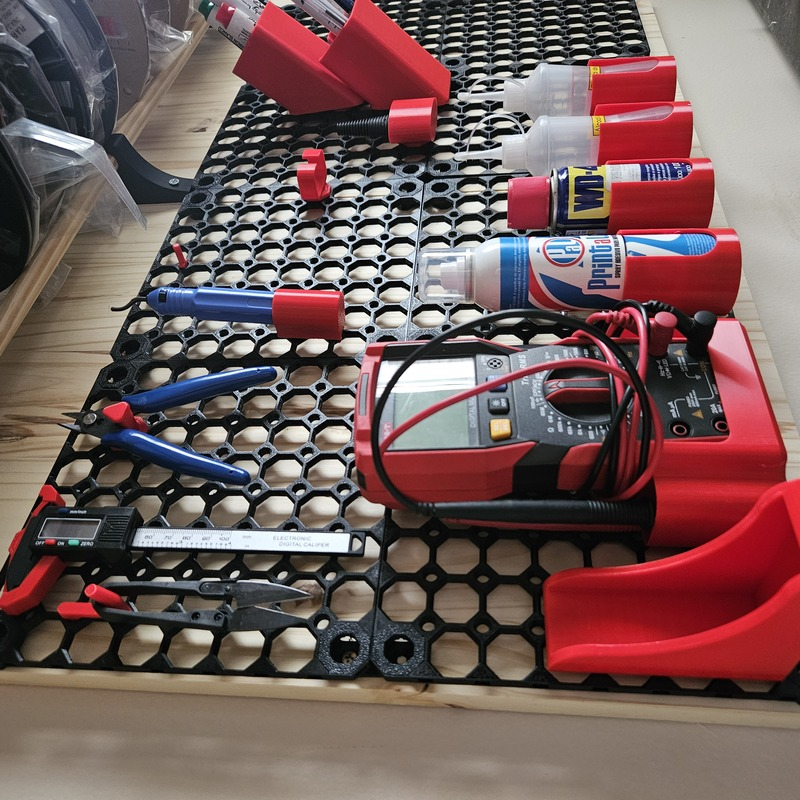

---

# My Original Models

# My Remixed Models

