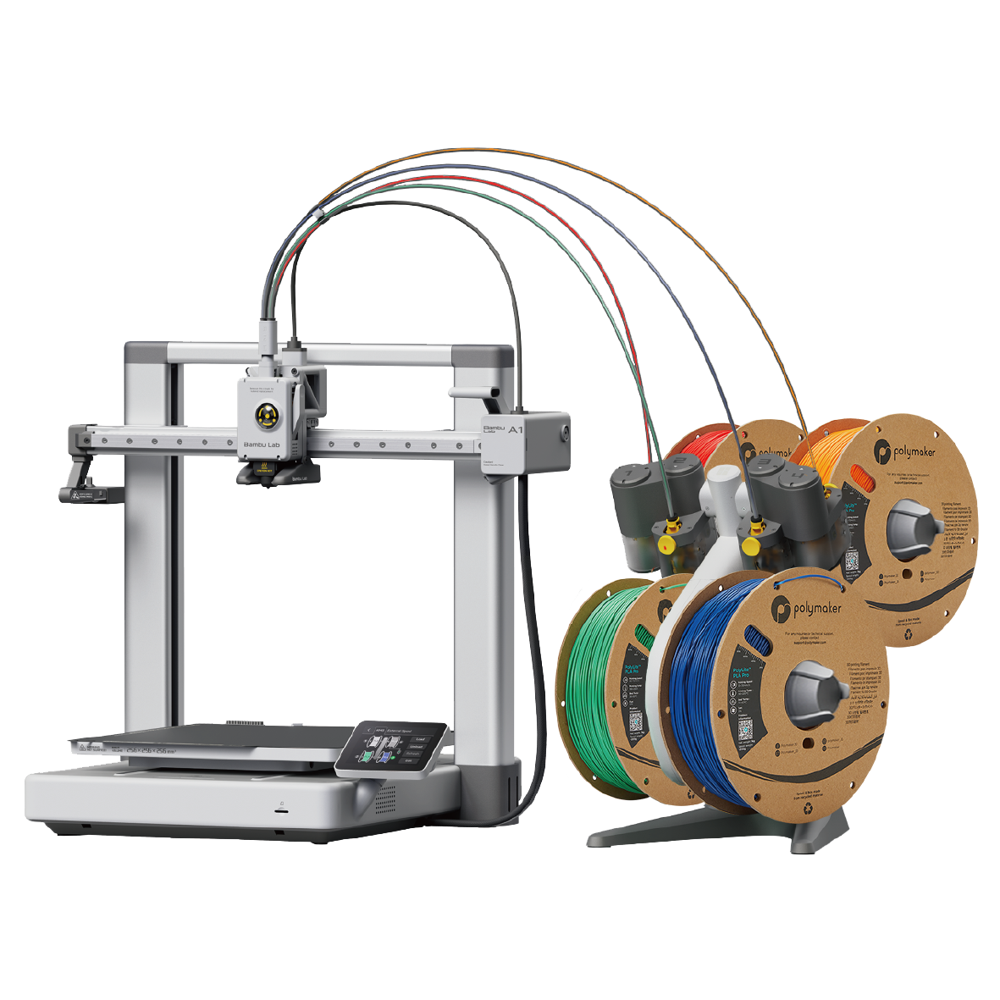
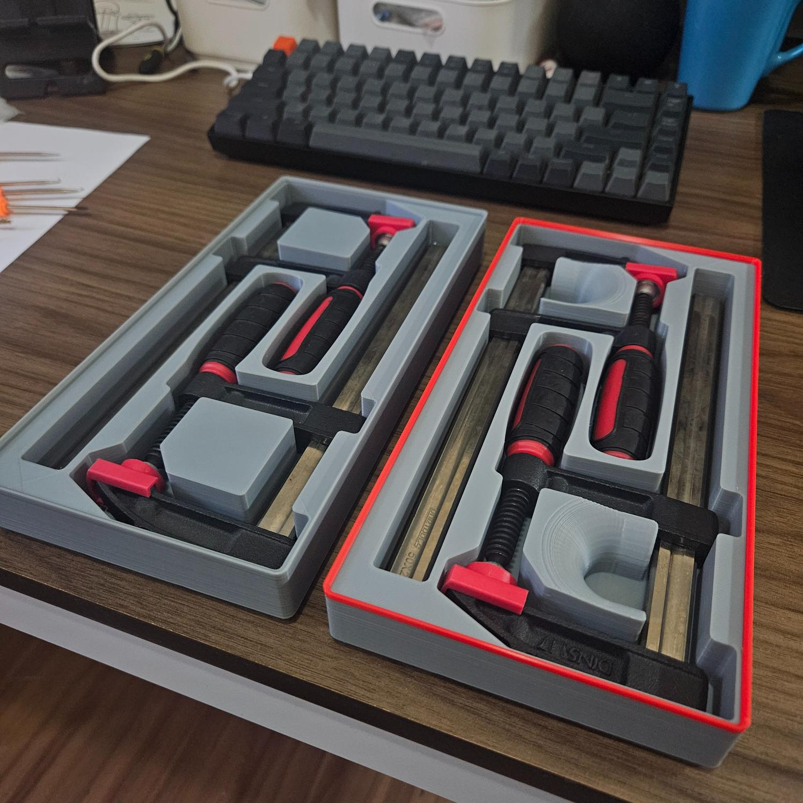
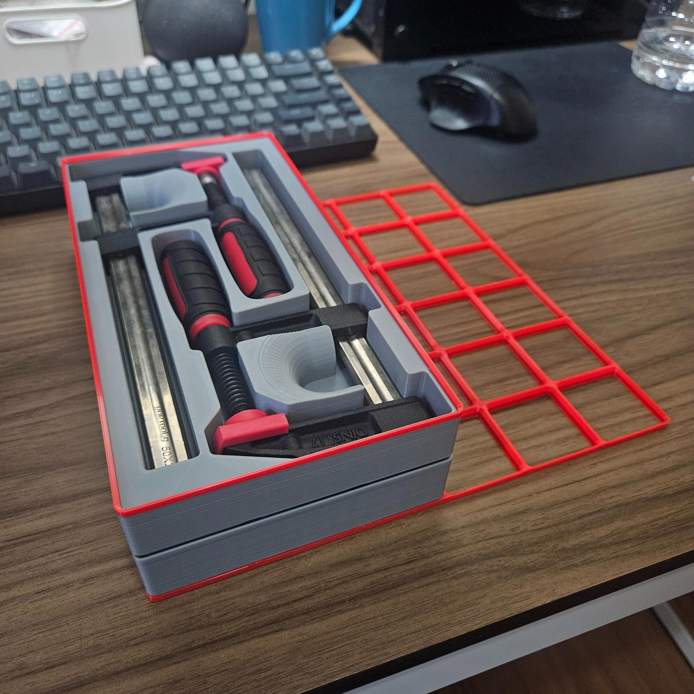
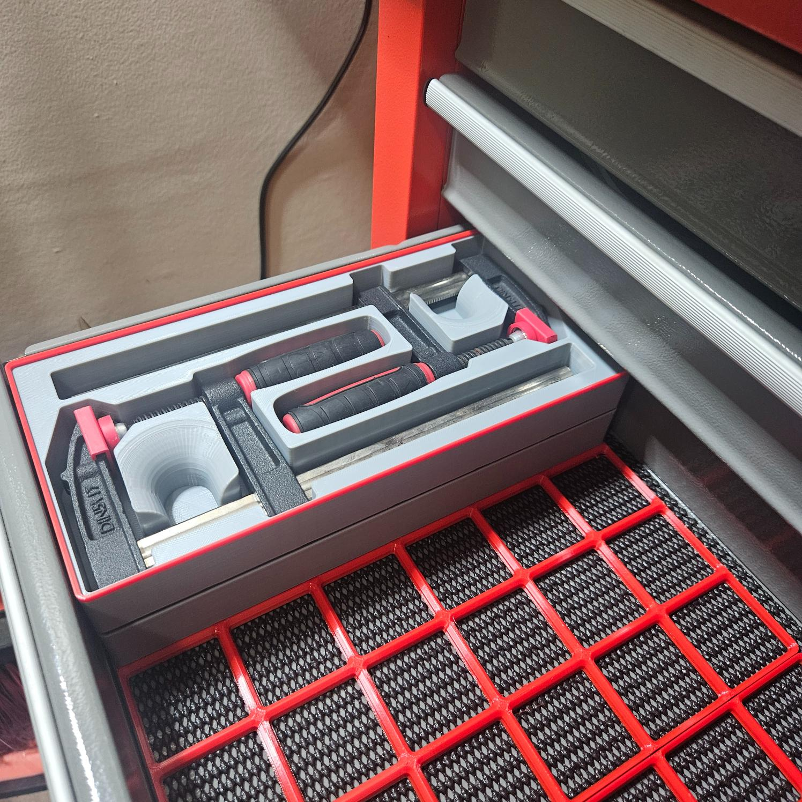
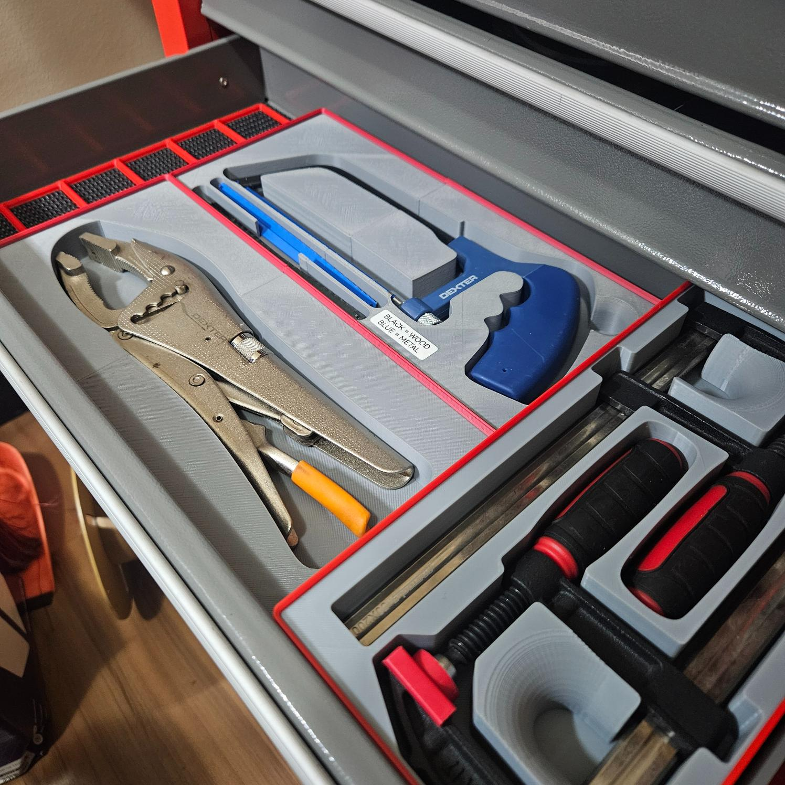

# Bambu Lab A1 3D Printer Documentation

This document repo as a personal knowledge base and future reference for settings, essential information, collected 3D models, upgrades, and projects related to the Bambu Lab A1 3D Printer.

## Technical Specifications
*Source: [Technical Specifications A1](https://bambulab.com/en/a1/tech-specs)*

| Parameter | Value |
|:---|:---|
| Number of Toolheads | 1 |
| Multi-Color Capability | 4 Colors (via included AMS lite) |
| Build Volume (W×D×H) | 256 mm × 256 mm × 256 mm |
| Printing Method | Wi-Fi (Bambu Studio, Handy App) / Micro SD Card |
| HMI (Interface) | 3.5-inch 320x240 IPS Touch Screen |
| Max Toolhead Speed | 500 mm/s |
| Max Toolhead Acceleration | 10,000 mm/s² |
| Max Hot End Temperature | 300 °C (All-Metal Hot End) |
| Max Heated Bed Temperature | 100 °C |
| Printing Platform | Flexible Steel Plate |
| Compatible Build Plates | Bambu Textured PEI Plate, Cool Plate, High Temperature Plate |
| Print Accuracy Features | Full-Auto Calibration (Z-Offset, Bed Leveling, Vibration) |
| Recommended Filament (Ideal) | PLA, PETG, TPU, PVA |
| Consumable Filament Diameter | 1.75 mm |
| Print File Format | G-Code |
| Machine Dimensions (W×D×H) | 465 mm × 410 mm × 430 mm |
| Machine Weight (Net) | 8.3 kg |
| Power Supply (Input/Max Power) | 100–240 VAC, 50/60 Hz / 350W (110V) or 1300W (220V) |
| Motion Controller | Dual-Core Cortex M4 |
| Connectivity | Wi-Fi, Bambu-Bus |
| Camera | Low Rate Camera (Up to 1080P) |

## Upgrades and Accessories
### AMS Lite Numbers Highlight

[Source]([https://www.youtube.com/watch?v=zCa1xiqe8FM](https://makerworld.com/en/models/928502-enveloping-ams-lite-number-covers#profileId-892075))

---

## Projects & Organizational Systems

### Multiboard
A free-to-use wall-mounted storage system that uses slotted or perforated panels to hold interchangeable modules. It is **free** but **not open-source**. The design focuses on flexible vertical organization and rapid rearrangement.

* **Official Website:** [http://multiboard.io/](http://multiboard.io/)
* **Original Creator:** Jonathan (Keep Making)
* **Introduction Video:** [The Last 3D Printed Storage System You'll Ever Need : Multiboard](https://www.youtube.com/watch?v=zCa1xiqe8FM)

**My Build:**

|  |  |  |
|:---|:---|:---|
|  |  |  |
|  |  |  |

### Gridfinity
A modular storage system based on a standardized 42×42 mm grid, ensuring compatibility between all modules. It is **free and open-source**. Optimized for dense organization of small items using stackable containers and inserts.

* **Official Website:** [https://gridfinity.xyz/](https://gridfinity.xyz/)
* **Original Creator:** Zack Freedman
* **Introduction Video:** [Gridfinity: Your Ultimate Modular Workshop is FREE!](https://www.youtube.com/watch?v=ra_9zU-mnl8&t=275s)

**My Build:**

|  |  |  |
|:---|:---|:---|
|  |  |  |
|  |  |  |

---

## My Original Models

## My Remixed Models

